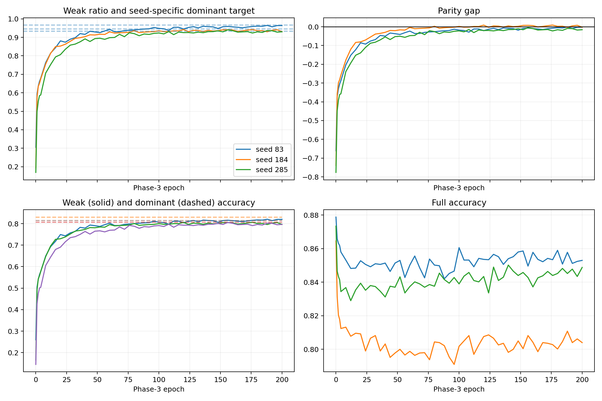

# Analiza pełnych trajektorii relative unimodal parity

Wszystkie decyzje poniżej wykorzystują wyłącznie validation proper.
Test nie był liczony ani używany.

| seed | target R_D | max R_W (e3) | gap | spadek full | parity hits | tol=.005 stop/select |
|---:|---:|---:|---:|---:|---:|---:|
| 83 | 0.9663 | 0.9645 (188) | -0.0018 | 0.0210 | — | 200/196 |
| 184 | 0.9334 | 0.9423 (176) | 0.0089 | 0.0618 | 80;100;112;116;120;128;132;140;144;148;152;156;160;168;172;176;180;184;192;196 | 96/92 |
| 285 | 0.9457 | 0.9407 (156) | -0.0050 | 0.0306 | — | —/— |

## Wnioski

- Średni najlepszy gap wynosi 0.0007; dokładne dwa kolejne trafienia nie wystąpiły w żadnym seedzie.
- Epoki maksimum weak ratio: 188, 176, 156; średnia 173.3.
- Zakres dominant-only accuracy w obrębie trajektorii wynosi maksymalnie 0.00000000, co potwierdza zamrożenie left/shared.
- Równość surowych accuracy nie jest równoważna znormalizowanemu parity i pozostaje wyłącznie diagnostyką.
- Następny stopper powinien używać non-inferiority/tolerancji niepewności wokół parity oraz osobnego constraintu full accuracy.

Osiągnięcie maksimum weak ratio nie gwarantuje najlepszego downstream P4. Należy uruchomić P4 z kandydatów wybranych bez używania testu.

