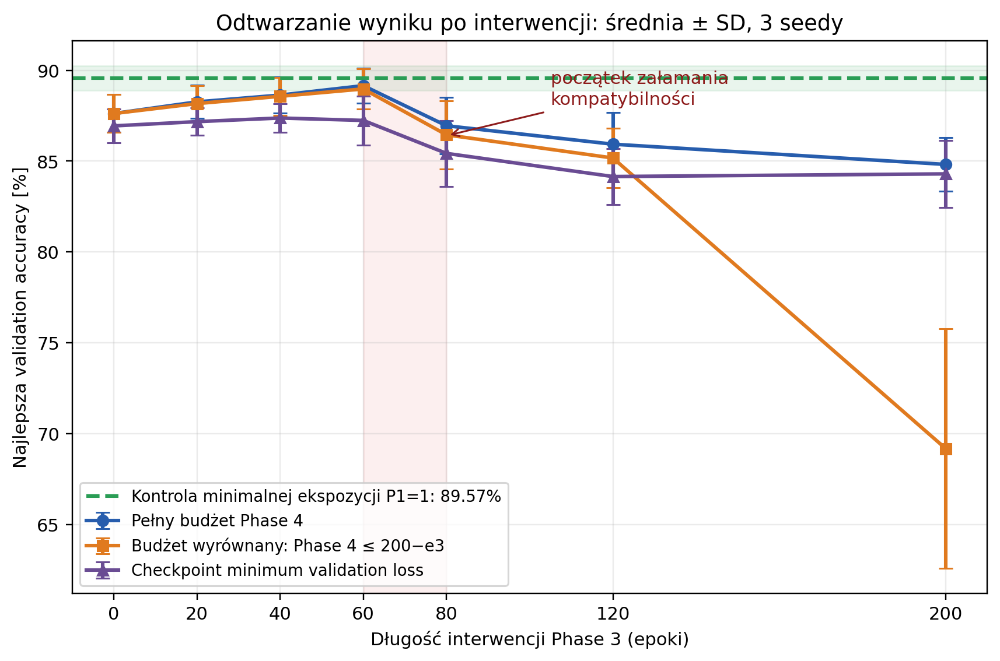
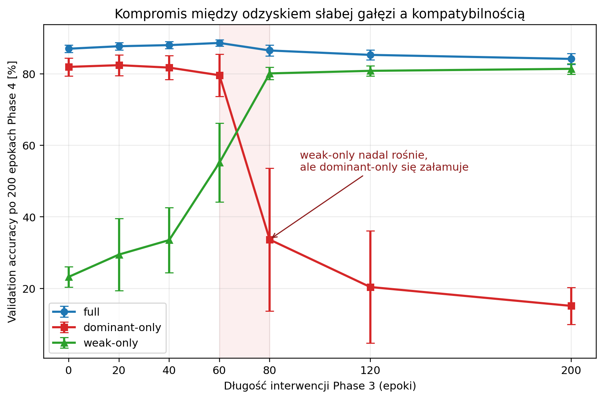
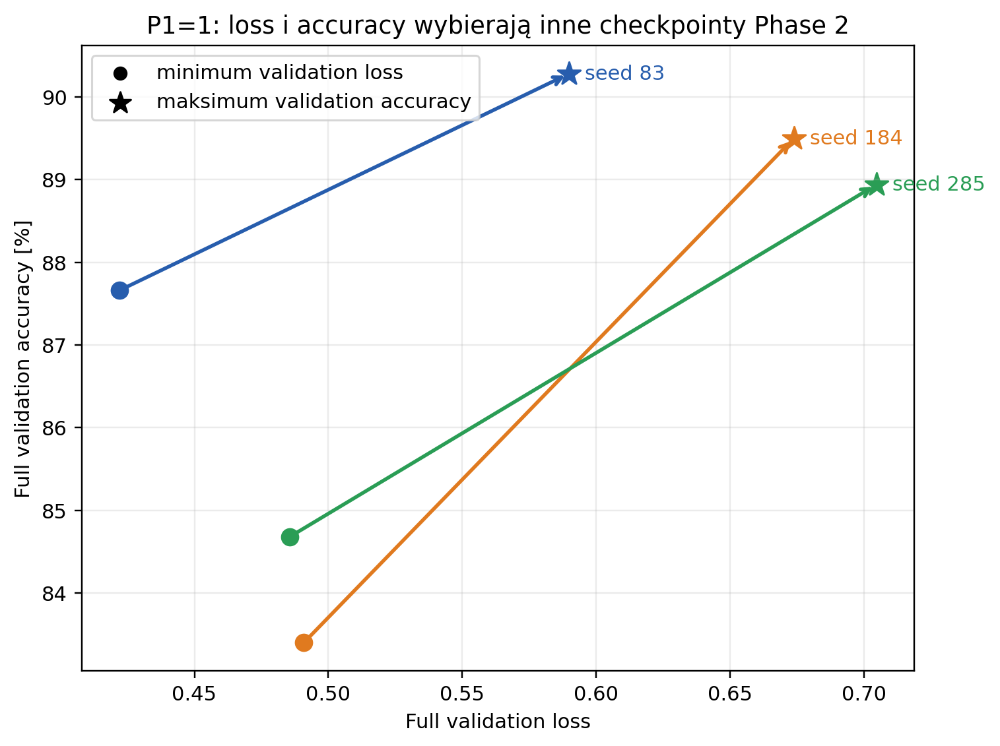

# Phase 3/4 validation sweep — 2026-07-29

## Scope

This report analyses three paired model seeds (`83`, `184`, `285`) for:

- Phase 1: 80 epochs,
- Phase 2: 200 epochs,
- Phase 3: `e3 ∈ {0, 20, 40, 60, 80, 120, 200}`,
- Phase 4: at most 200 epochs.

All selection metrics come from `validation_proper`. The test set was disabled.
Scalar exports with W&B run identifiers are stored in:

- `analysis/results/phase3_phase4_grid_2026-07-29.csv`,
- `analysis/results/phase2_minimal_exposure_p1_1_2026-07-29.csv`.

The figures can be regenerated with:

```bash
scripts/bash/clp_python_local.sh \
  scripts/python_new/plot_phase3_phase4_grid.py
```

This command only processes the small scalar CSV exports. It does not load a
dataset or model and does not perform tensor-batch work.

## Recovery result



The full-budget and budget-matched validation-accuracy optima both occur around
`e3=60`. The mean full-budget validation accuracy is:

- `e3=0`: 87.62%,
- `e3=60`: 89.15%,
- `e3=80`: 86.95%.

The P1=1 minimal-exposure control mean is 89.57%. Thus `e3=60` closes approximately 79%
of the gap between the no-intervention condition and the one-epoch minimal-exposure control under
the full Phase-4 budget. Under the `200-e3` budget it closes approximately 69%.

## Compatibility trade-off



At the Phase-4 endpoint, increasing Phase 3 from 60 to 80 epochs changes the
three-seed means as follows:

- dominant-only accuracy: 79.59% → 33.66%,
- weak-only accuracy: 55.15% → 80.10%,
- full accuracy: 88.61% → 86.51%.

The left value always denotes `e3=60`; the right value denotes `e3=80`.
Weak-branch recovery continues while compatibility with the dominant branch
collapses. This identifies the interval `(60, 80]` as the first coarse region
that must be resolved by a denser sweep or an online compatibility guard.

The scalar weak utility

```text
dominant_only_loss - full_loss
```

becomes pathological in this region: it can increase because dominant-only
loss explodes. Weak utility must therefore never be maximized without an
explicit compatibility constraint.

## Validation loss versus accuracy



`P1=1` means one real epoch of blurred-right exposure in the active trainer; it
is not the clean gold standard. The true `P1=0, P2=200` control is evaluated
separately.

For P1=1, minimizing full validation loss selects Phase-2 epochs 20–35, whereas
maximizing validation accuracy selects epochs 135–195. Their three-seed means
are:

- minimum-loss selection: 85.25% accuracy,
- maximum-accuracy selection: 89.57% accuracy.

An increasing cross-entropy loss is not a false signal. It reports that the
probability estimates are becoming worse, commonly because the remaining
errors are increasingly confident. It is, however, not an adequate sole proxy
for the accuracy outcome used in the paper.

The recommended selector is multi-objective:

1. identify checkpoints whose paired validation accuracy is non-inferior to
   the best observed validation accuracy;
2. among them choose the lowest unsmoothed negative log-likelihood;
3. use the earlier epoch as the final tie-breaker.

Until that rule is implemented and frozen, retain separate checkpoints for
minimum validation loss and maximum validation accuracy.

## Consequences for the Phase-3 controller

The current weak-recovery controller must not be used in enforce mode for a
publication run yet:

- weak-only loss contributes to recovery quality and trend detection;
- full and dominant loss define a separately recorded `safe` status;
- weak-recovery `feasible` currently does not require `safe`;
- checkpoint selection prefers `best_feasible` over `best_safe`.

The sweep demonstrates that this separation can select a checkpoint after
compatibility has already collapsed. Before the strict-right-branch experiment:

1. require recovery candidates to satisfy the compatibility guard;
2. retain accuracy-aware and loss-aware checkpoints separately;
3. log calibration diagnostics such as unsmoothed NLL, Brier score, ECE, mean
   confidence and mean confidence on incorrect predictions.

Implementation status (2026-07-30): all three safeguards above are now in the
active validation-controlled path. `feasible` requires compatibility safety,
Phase 2/4 retain both loss- and accuracy-selected checkpoints, and all four
validation modes log the listed calibration diagnostics. The historical sweep
numbers are unchanged; the corrected path still requires its compute smoke
before starting the strict-right-branch comparison.

## Recommended next experiment

After the selector/controller correction, compare:

- the current Phase-3 intervention,
- strict right-branch-only training with the shared trunk and classifier frozen,

for `e3 ∈ {40, 60, 80}` and the same three paired seeds. The `e3=0` results
from this sweep can be reused.
